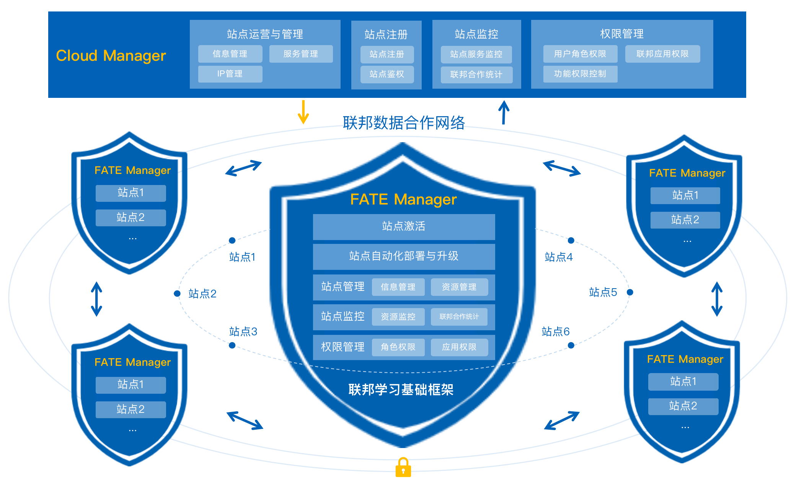

**DOC|[English](./README.md)**

## 简介 ##
作为构建和管理联邦数据合作网络的基础设施，FATE Cloud是首个工业级的联邦学习云服务。

FATE Cloud使fate实现了多云管理，形成了一种安全的联邦数据网络，旨在为跨机构间、机构内部不同组织间提供安全可靠、合规的数据合作网络构建解决方案，提供企业级的联邦学习生产力应用解决方案。

FATE-Cloud为搭建联邦数据网络提供了标准的联邦基础实施能力、技术支撑能力，统一的联邦站点管理模式和全流程服务，解决了不同机构或机构内部在联邦数据合作上的管理协同、数据处理与鉴权、合作效率低下、多方交互不流畅等问题。

## 功能 ##
FATE Cloud由负责联邦站点管理的云管理端Cloud Manager和站点客户端管理端FATE Manager组成，提供了联邦站点的注册与管理、集群自动化部署与升级、集群监控、集群权限控制等核心功能。

**联邦云管理端（Cloud Manager）**

联邦云管理端即联邦数据网络的管理中心，负责统一运营和管理FATE Manager及各站点，监控站点的服务与联邦合作建模，执行联邦各权限控制，保证联邦数据合作网络的正常运作；

**联邦站点管理端（FATE Manager）**

联邦站点管理端，负责管理和维护各自的联邦站点，为站点提供加入联邦组织、执行站点服务的自动化部署与升级，监控站点的联邦合作与集群服务，并管理站点用户角色与应用权限；

## 部署 ##
Cloud Manager作为一个单独的服务进行部署. 只要保证被部署的服务器存在jdk8的环境,并保证MySQL连接配置正确，就可以正常运行该服务。

FATE Manager是一个单独的应用，不依赖任何FATE服务。v1.0的FATE Manager支持通过KubeFATE来实现FATE的快速部署，所以在使用FATE Manager部署FATE之前，请确保已经部署好MySQL和[Kubernetes](http://kubernetes)集群。

有关更多详细的部署信息，请参考[FATE Cloud部署文档](http://bushu)。

## 使用 ##
部署完成后，FATE Cloud详细的使用方法请参考[《FATE Cloud产品使用手册》](http://manual)。

## FAQ ##
**Cloud-Manager 部署失败**

- 确认用来部署的服务器有maven环境. 它用来构建Cloud-Manager的jar包
- 确认部署服务器和目标服务器之间配置了ssh免密登入

**Cloud-Manager 启动失败**

- Cloud-Manager是个java服务,请确认目标机有jdk8的环境
- Cloud-Manager依赖于mysql.请确认mysql的连接配置正确
- 为服务提供足够的内存
- 确认端口没有被占用

**Cloud-Manager访问失败**

- 确认端口可以访问.需要防火墙放行该端口

**FATE-Manager启动失败**

- 检测kubectl是否有sudo权限，如果有，需要修改配置文件sudotag=true
- 检测mysql的链接配置是否正常

**部署connect失败**

- 检测kuefate的url是否携带端口号
- 查看kubefate的服务是否正常

**FATE部署失败**

- 通过查看日志进行分析，确保node机器具有dockerhub的访问权限，或者已经提前load好docker镜像

**部署autotest失败**

- 查看rollsite路由表的配置是否正确