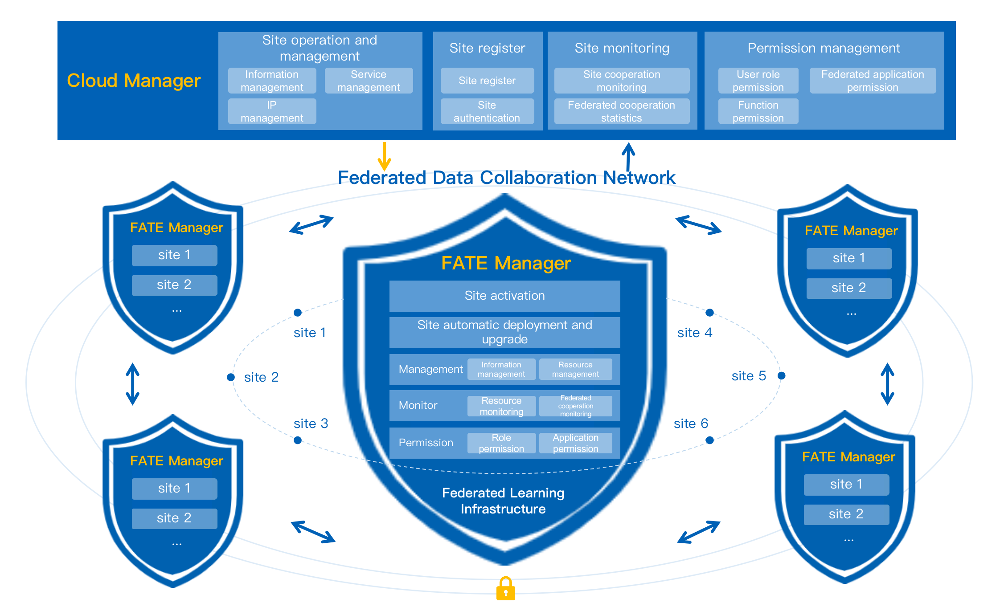

**DOC|[中文](./README-CN.md)**

## Overview ##
As an infrastructure for building and managing Federated Data Collaboration Network, FATE Cloud is the first industrial-grade Federated Learning Cloud Service. 

FATE Cloud enables FATE to be managed in multi-cloud, forming a secure federated data network, designed to provide a secure and compliant data cooperation solutions across or within organizations, and provide an enterprise-level federated learning productivity application solution.

FATE-Cloud provides standard federated infrastructure implementation capabilities, technical support capabilities, a unified federated site management mode and the whole process service, and addresses the problems of management collaboration, data processing and authentication, low cooperation efficiency, and poor interaction among different organizations.

## Major features ##
FATE Cloud is composed of Cloud Manager, which is responsible for federated site management, and FATE Manager, a site client management terminal. It provides registration and management of federated sites, automated cluster deployment and upgrades, cluster monitoring, and permission control and other core functions. 

**Federated Cloud（Cloud Manager）**

Cloud Manager is the management center of the federated network, which is responsible for the unified operation and management of FATE Manager and each site, monitors the services of the site and Federated cooperation modeling, performs the federated permission control, and ensures the normal operation of federated data cooperation network.

**Federated Site（FATE Manager）**

FATE Manager is responsible for the management and maintenance of their respective federated sites, providing services such as a site joining the Federation Organization, automatic deployment and upgrade of a site, monitor of the federated cooperation modeling and cluster services of a site, and management of user roles and application permissions of a site, etc.

## Deploy ##
Cloud Manager is deployed as a separate service. As long as the deployed server has jdk8 environment and MySQL connection configuration is correct, the service can run normally. 

For more detailed deployment information，please refer to FATE Cloud Deployment:
- Method 1(ansible): [FATE-Cloud](docs/FATE-Cloud_install_guide_ansible.md)
- Method 2(单独部署): [Cloud-Manager](cloud-manager/deploy/doc/Cloud-Manager_Deploy_Guide.md) and [FATE-Manager](fate-manager/deploy/FATE-Manager_Install_Guide.md)

## Usage ##
After deployment，please prefer to "[FATE Cloud product manual](./docs/FATE-Cloud产品使用手册v1.4.0.pdf)" for detailed usage of FATE Cloud.

## FAQ ##
**Cloud Manager failed to deploy.**

- Confirm that the server used for deployment has a maven environment. It's used to build the jar package of Cloud Manager.
- Confirm that SSH password-free login is configured between the deployment server and the target server.

**Cloud Manager failed to start.**

- Cloud Manager is a java service. Please confirm that the target machine has a jdk8 environment.
- Cloud Manager depends upon MySQL. Please confirm that the configurations of MySQL is correct.
- Provide enough memory for the service.
- Confirm that the port number is not occupied.

**Cloud Manager access failed.**

- Confirm that the port can be accessed. The port needs to be opened by the firewall.

**FATE Manager failed to start.**

- Check whether kubectl has the permission of sudo. If so, modify the configuration file sudotag=true.
- Check whether the link configuration of MySQL if normal.

**Failed to connect deployment.**

- Check whether the url of KubeFATE carries port number.
- Check whether KubeFATE’s service is normal.

**FATE deployment failed.**

- Check the log for analysis to ensure that the mode machine has access to dockerhub, or the docker image has been loaded in advance.

**Autotest failed in deployment.**

- Check whether the routing table of the rollsite is configured correctly.
