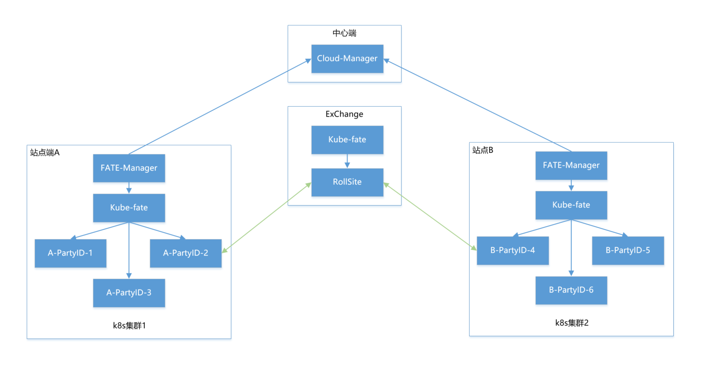
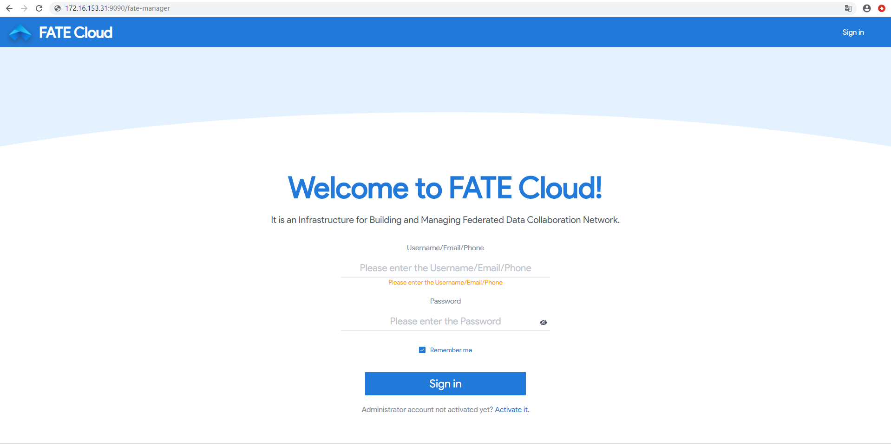

# FATE-Manager部署指引文档 #


<div style="text-align:center", align=center>

</div>


## 1. 用户设置 ##

**1）创建app用户和apps组**
注意 : 以下操作需root权限
```
groupadd -g 6000 apps
useradd -s /bin/bash -g apps -d /home/app app
passwd app
```

**2）配置sudo**
注意 : 以下操作需root权限
```
vim /etc/sudoers.d/app
app ALL=(ALL) ALL
app ALL=(ALL) NOPASSWD: ALL
Defaults !env_reset
```

## 2. 基于Kubernetes构建FATE ##
FATE Manager支持在Kubernetes环境上上构建FATE以及裸机上直接构建FATE

#### 2.1 MiniKube部署 ####

为了方便快速的部署，我们使用`miniKube`来部署`kubernetes`环境，前置条件如下:

- 2台Linux的服务器，由于需要跑多方计算，服务器的推荐配置为：8核，16G内存以上；

- Linux服务器需要预先安装好`Docker`环境，具体参考[Install Docker in CentOS](https://github.com/docker/docker-install)；

- 要保证安装机器可以正常访问`Docker Hub`，以及`Google存储`；

- 预先创建一个目录，以便整个过程使用该目录作为工作目录，命令如下
```
cd ~ && mkdir -p /data/kubefate && cd /data/kubefate
```

**注意：下文介绍的MiniKube机器IP地址是`172.16.153.131`。请修改为你准备的实验机器IP地址！！！**

- **安装需要的工具**
为了使用KubeFATE部署FATE，我们需要以下工具：
MiniKube v1.7.3，如果我们已经有Kubernetes环境，可以直接跳转到部署KubeFATE服务;
kubectl v1.17.3：Kubernetes的命令行，需要与具体Kubernetes版本对应，这里的版本是对应MiniKube v1.7.3；

	KubeFATE:
	       - Release: v1.4.4
	       - 服务版本：v1.1.0
	       - 命令行版本：v1.1.0
	       
- **安装kubectl**
```
curl -LO https://storage.googleapis.com/kubernetes-release/release/v1.17.3/bin/linux/amd64/kubectl && chmod +x ./kubectl && sudo mv ./kubectl /usr/bin
```
执行完后可以验证是否成功:
```
[app@kube-m1 kubefate]$ kubectl version
Client Version: version.Info{Major:"1", Minor:"17", GitVersion:"v1.17.3", GitCommit:"06ad960bfd03b39c8310aaf92d1e7c12ce618213", GitTreeState:"clean", BuildDate:"2020-02-11T18:14:22Z", GoVersion:"go1.13.6", Compiler:"gc", Platform:"linux/amd64"}
The connection to the server localhost:8080 was refused - did you specify the right host or port?ction to the server localhost:8080 was refused - did you specify the right host or port?
```

- **安装MiniKube**
```
curl -LO https://github.com/kubernetes/minikube/releases/download/v1.7.3/minikube-linux-amd64 && mv minikube-linux-amd64 minikube && chmod +x minikube && sudo mv ./minikube /usr/bin
```
验证安装结果:
```
[app@kube-m1 kubefate]$ minikube version
minikube version: v1.7.3
commit: 436667c819c324e35d7e839f8116b968a2d0a3ff
```

- **下载KubeFATE的发布包并安装KubeFATE的命令行**

我们从Github上 KubeFATE Release页面找到Kuberetes部署的下载包，并下载:
```
curl -LO https://github.com/FederatedAI/KubeFATE/releases/download/v1.4.4/kubefate-k8s-1.4.4.tar.gz && tar -xzf ./kubefate-k8s-1.4.4.tar.gz
```
解压：
```
[app@kube-m1 kubefate]$ ls
cluster.yaml  config.yaml  kubefate  kubefate-k8s-1.4.4.tar.gz  kubefate.yaml  rbac-config.yaml
```
由于KubeFATE命令行是可执行二进制文件，可以直接移动到path目录方便使用，
```
chmod +x ./kubefate && sudo mv ./kubefate /usr/bin
```
然后我们测试下kubefate命令是否可用，
```
[app@kube-m1 kubefate]$ kubefate version

* kubefate service connection error, Get http://kubefate.net/v1/version: dial tcp: lookup kubefate.net: no such host

* kubefate commandLine version=v1.1.0
```
我们发现获取KubeFATE服务版本报了个错，这是因为我们还没部署KubeFATE的服务；而命令行的版本已经正常显示出来了。
至此，我们需要的工具已经安装完成。

- **使用MiniKube安装Kubernetes**
MiniKube支持使用不同的虚拟机来部署Kubernetes，但是在Linux环境下，我们建议直接使用Docker方式。这个方式非常简单，只需要设置--vm-driver=none即可。更多的说明参考：[Install MiniKube - Install a Hypervisor](https://minikube.sigs.k8s.io/docs/start/)
```
sudo minikube start --vm-driver=none --image-repository=registry.cn-hangzhou.aliyuncs.com/google_containers
```
根据屏幕指引，稍等一小会。待到命令没有错误返回，我们可以验证下，
```
[app@kube-m1 kubefate]$ sudo minikube status
host: Running
kubelet: Running
apiserver: Running
kubeconfig: Configured
```
如果你的显示和上面一样，那恭喜你，一个单节点的Kubernetes已经部署好在你的服务器里了！但是，还有一个小步骤要做，因为我们KubeFATE通过Ingress向外提供服务，而MiniKube默认并没有启动Ingress模块，所以需要手动启动，
```
sudo minikube addons enable ingress
```

kubernetes部署完成！


#### 2.2 KubeFATE部署 ####


- **创建kube-fate的命名空间以及账号**

在我们的安装包里已经包含了相关的yaml文件rbac-config.yaml，并且前面的准备工作已解压这个文件到你的工作目录。我们只需要直接执行，
```
kubectl apply -f ./rbac-config.yaml
```
- **在kube-fate命名空间里部署KubeFATE服务**
- 
相关的yaml文件也已经准备在工作目录，直接使用kubectl apply，
```
kubectl apply -f ./kubefate.yaml
```
稍等一会，大概10几秒后用下面命令看下KubeFATE服务是否部署好`kubectl get all,ingress -n kube-fate`。如果返回类似下面的信息（特别是pod的STATUS显示的是Running状态），则KubeFATE的服务就已经部署好并正常运行：
```
[app@kube-m1 kubefate]$ sudo kubectl get all,ingress -n kube-fate
NAME                            READY   STATUS    RESTARTS   AGE
pod/kubefate-549d6978c7-s42m8   1/1     Running   4          19d
pod/mariadb-7f597bf99b-ml5qw    1/1     Running   1          19d

NAME               TYPE        CLUSTER-IP       EXTERNAL-IP   PORT(S)    AGE
service/kubefate   ClusterIP   10.110.87.188    <none>        8080/TCP   19d
service/mariadb    ClusterIP   10.110.130.177   <none>        3306/TCP   19d

NAME                       READY   UP-TO-DATE   AVAILABLE   AGE
deployment.apps/kubefate   1/1     1            1           19d
deployment.apps/mariadb    1/1     1            1           19d

NAME                                  DESIRED   CURRENT   READY   AGE
replicaset.apps/kubefate-549d6978c7   1         1         1       19d
replicaset.apps/mariadb-7f597bf99b    1         1         1       19d

NAME                          CLASS    HOSTS            ADDRESS          PORTS   AGE
ingress.extensions/kubefate   <none>   kubefate88.net   172.16.153.131   80      19d
```
- **添加kubefate.net到hosts文件**

因为我们要用 kubefate.net 域名来访问KubeFATE服务（该域名在ingress中定义，有需要可自行修改），需要在运行kubefate命令行所在的机器配置hosts文件（注意不一定是Kubernetes所在的机器）。如果网络环境有域名解析服务，可配置kubefate.net域名指向MiniKube机器的IP地址，这样就不用配置hosts文件。
注意：下面地址172.16.153.131 要替换为你的MiniKube机器地址。
```
sudo -- sh -c "echo \"172.16.153.131 kubefate.net\"  >> /etc/hosts"
```
添加完毕后，可以验证是否生效：
```
[app@kube-m1 kubefate]$ ping -c 2 kubefate.net
PING kubefate88.net (172.16.153.131) 56(84) bytes of data.
64 bytes from kube-n1 (172.16.153.131): icmp_seq=1 ttl=64 time=0.729 ms
64 bytes from kube-n1 (172.16.153.131): icmp_seq=2 ttl=64 time=0.710 ms

--- kubefate88.net ping statistics ---
2 packets transmitted, 2 received, 0% packet loss, time 1000ms
rtt min/avg/max/mdev = 0.710/0.719/0.729/0.028 ms
```
同时，如果我们重新执行kubefate version，显示就会一切正常如下，
```
[app@kube-m1 kubefate]$ kubefate version
* kubefate service version=v1.1.0
* kubefate commandLine version=v1.1.0
```

到此，所有准备工作完毕，下面我们可以开始安装FATE了。需要注意的是，上面的工作只需要做一次，后面如果添加、删除、更新FATE集群，上面的不需要重新执行


## 3. 裸机构建FATE ##
FATE Manager支持在Kubernetes环境上上构建FATE以及裸机上直接构建FATE

请参考[Hyperion部署文档](../hyperion/deploy/Hyperion_deploy_guide_zh.md)

## 4. Mysql部署 ##

- **获取安装包**
```
mkdir -p /data/projects/install
cd /data/projects/install
wget https://webank-ai-1251170195.cos.ap-guangzhou.myqcloud.com/mysql-1.4.5-release.tar.gz
```
- **建立mysql根目录**

```
mkdir -p /data/projects/fate-cloud/common/mysql
mkdir -p /data/projects/fate-cloud/data/mysql
```
- **解压缩软件包**

```
cd /data/projects/install
tar xzvf mysql-*.tar.gz
cd mysql
tar xf mysql-8.0.13.tar.gz -C /data/projects/fate-cloud/common/mysql
```
- **配置设置**

```
mkdir -p /data/projects/fate-cloud/common/mysql/mysql-8.0.13/{conf,run,logs}
cp service.sh /data/projects/fate-cloud/common/mysql/mysql-8.0.13/
cp my.cnf /data/projects/fate-cloud/common/mysql/mysql-8.0.13/conf
```
- **初始化**

```
cd /data/projects/fate-cloud/common/mysql/mysql-8.0.13/
./bin/mysqld --initialize --user=app --basedir=/data/projects/fate-cloud/common/mysql/mysql-8.0.13 --datadir=/data/projects/fate-cloud/data/mysql > logs/init.log 2>&1
cat logs/init.log |grep root@localhost
```
 **注意输出信息中root@localhost:后的是mysql用户root的初始密码，需要记录，后面修改密码需要用到**

- **修改my.cnf**
```
vim /data/projects/fate-cloud/common/mysql/mysql-8.0.13/conf/my.cnf
sql_mode=STRICT_TRANS_TABLES,ERROR_FOR_DIVISION_BY_ZERO,NO_ENGINE_SUBSTITUTION
```
- **启动服务**
```
cd /data/projects/fate-cloud/common/mysql/mysql-8.0.13/
nohup ./bin/mysqld_safe --defaults-file=./conf/my.cnf --user=app >>logs/mysqld.log 2>&1 &
```
- **修改mysql root用户密码**

```
cd /data/projects/fate-cloud/common/mysql/mysql-8.0.13/
./bin/mysqladmin -h 127.0.0.1 -P 3306 -S ./run/mysql.sock -u root -p password "fate_dev"
Enter Password:【输入root初始密码】
```
- **验证登陆**

```
cd /data/projects/fate-cloud/common/mysql/mysql-8.0.13/
./bin/mysql -u root -p -S ./run/mysql.sock
Enter Password:【输入root修改后密码:fate_dev】
```
部署成功！

## 5. FATE-Manager部署 ##

- **服务基本信息**
|   服务名称    | 端口 | 描述                                              |
| :-----------: | ---- | ------------------------------------------------- |
|fate_manager|9090|fate-manger,站点端用于注册和加入联邦组织，快速部署fate的管理端工具｜

- **下载fate-manager**
FATE-Manager的开源地址https://github.com/FederatedAI/FATE-Cloud
打开链接https://github.com/FederatedAI/FATE-Cloud/releases
fate-manager是容器化部署fate的最佳实践，项目更新较快，建议使用最新的releases
```
[app@kube-m1 kubefate]$ mkdir -p /data/projects/fate-cloud/fate-manager && cd /data/projects/fate-cloud/fate-manager
[app@kube-m1 fate-manager]$ curl -LO https://github.com/FederatedAI/FATE-Cloud/releases/download/v1.1.0/fate-manager-1.1.0.tar.gz && tar -xzf ./fate-manager-1.1.0.tar.gz
```
解压后内容：
```
[app@kube-m1 fate-manager]$ ls
conf  fate_manager fate-manager shell doc-sql bin
```
conf：是服务的配置目录
fate_manager：是二进制文件
shell：单边，双边及最小化测试的shell脚本文件；初始化mysql配置文件
doc-sql：db建表语句及初始化配置信息
fate-manager：前端文件

- **建库授权和业务配置**
```
cd /data/projects/fate/common/mysql/mysql-8.0.13/
./bin/mysql -u root -p -S ./run/mysql.sock
Enter Password:【fate_dev】

#创建fate-manager库表及初始化配置信息
mysql>source /data/projects/fate-cloud/fate-manager/doc-sql/create-fate-manager-tables.sql;

#校验
mysql>select User,Host from mysql.user;
mysql>show databases;
mysql>use fate-manager;
mysql>show tables;
```

- **修改配置文件conf/app.ini**
```
[server]                                       #服务配置
RunMode = release                              #运行模型，test，debug，release
HttpPort = 9090                                #服务端口，默认9090
ReadTimeout = 60                               #读超时控制
WriteTimeout = 60                              #写超时控制
LogSavePath = ./logs/                          #日志目录地址
TimeFormat = 20060102
IfProxy = false                                #是否走代理
ProxyUrl =                                     #代理地址
IfSSL = true

[database]                                     #数据库配置
Type = mysql                                   #数据库类型，默认mysql
UserName =                                     #mysql用户名
Password =                                     #mysql密码
HostAddr =  192.168.0.1:3306                   #mysql地址，ip：port
DataBase =  fate-manager                       #数据库
TablePrefix = t_fate_                          #公共表头
SqlMode = false                                #sql打印日志

[schedule]                                     #定时器配置
IpManager = 10                                 #本地出入口ip上报
Heart = 60                                     #心跳上报
Job = 30                                       #部署任务结果查询
Test = 30                                      #单边、双边及最小化验证结果定时扫描

[deploy]                                       #部署配置
KubeFateUrl=http://kubefate.net:30732          #kubefate服务地址
ExchangeIp=172.16.153.131                      #路由服务出入口ip
ExchangePort=30001                             #路由服务出入口端口
NodeManager=0                                  #nodemanger的个数，0代表1个
Registry=                                      #镜像地址配置，可以配置私有镜像源
SudoTag=false                                  #kubectl是否需要sudo权限，默认不需要
SessionProcessorsPerNode=4                     #process个数
TestPartyId=10000                              #跑toy及最小化验证的另一侧partyid
WorkMode=1                                     #0为单点部署，1为集群部署
AnsibleNode=                                   #hyperion部署机器
```

- **执行部署**
```
chmod 777 ./fate_manager
nohup ./fate_manager &

查案进程：
ps aux | grep fate_manager
```

- **部署验证**
FATE-Manager地址：http://ip:9090/fate-manager
访问正常页面如下：
<div style="text-align:center", align=center>

</div>

[《FATE Cloud产品使用手册》](../../docs/FATE-Cloud产品使用手册v1.0.pdf)。